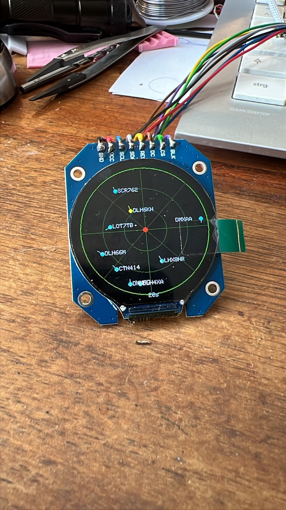

# ESP32 Flight Radar Desktop

A small desktop flight radar built with an ESP32 and a round display.

The radar shows live aircraft positions around your location using data from the OpenSky Network. Aircraft are displayed as moving markers with direction indicators and flight information.

## Features

- Live aircraft tracking
- Aircraft positions updated automatically
- Flight direction indicators
- Aircraft details on screen
- Configurable radar range
- OpenSky Network API support
- Works with or without an OpenSky API account
- Mobile-friendly configuration webpage
- Animated aircraft movement between updates
- 3D printable desktop enclosure

## Preview

## Hardware

### Required Parts

- ESP32-S3 super-mini
- Round TFT display
- USB cable
- 3D printed enclosure
- Wi-Fi connection

## 3D Printed Parts

The STL files for the enclosure are included in this repository.

Print the following parts:

- Base
- Display holder

Recommended material:

- PLA
- Layer height: 0.2 mm
- Infill: 15–20%

## Software

### Installation

1. Clone this repository.
2. Open the project in Arduino IDE.
3. Install all required libraries.
4. Select your ESP32 board.
5. Compile and upload the firmware.

### Required Libraries

- WiFi
- WebServer
- ArduinoJson
- TFT_eSPI
- HTTPClient

Additional display libraries may be required depending on your display hardware.

## Configuration

After the first start, connect to the device configuration page.

Configure:

- Wi-Fi SSID
- Wi-Fi password
- Latitude
- Longitude
- Radar range
- OpenSky username (optional)
- OpenSky password or API key (optional)

If no OpenSky credentials are provided, the radar will use the public API limits.

## OpenSky Network

Aircraft data is provided by:

https://opensky-network.org

Creating a free account allows higher request limits and better availability.

## Display Information

The direction line indicates the current flight path.

## How It Works

1. The ESP32 downloads aircraft data from OpenSky Network.
2. Aircraft inside the selected radius are filtered.
3. Positions are converted to radar coordinates.
4. Aircraft are displayed on the radar screen.
5. Between updates, aircraft positions are smoothly animated based on their current speed and heading.

